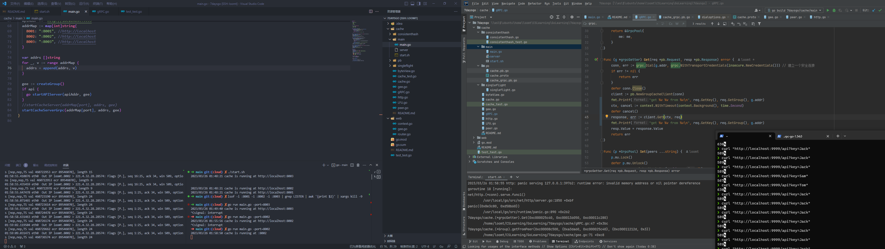
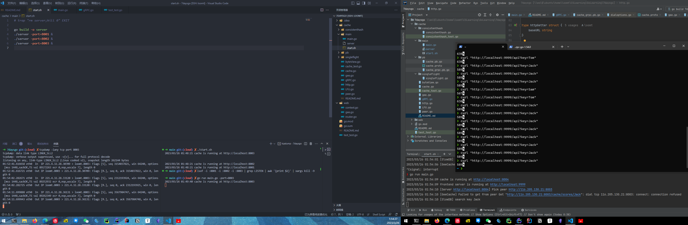

### Usage
Start multiple server and one main server, and the main server opens an HTTP port to listen for `Get` requests.

```zsh
cd main
sudo chmod 777 start.sh
./start.sh
```

### Workflow
- If the cache hit, return the cached data.
- If the cache not hit and the hash value points to a remote node, use gRPC or HTTP to request the cache from the peer node.
- If the cache not hit and the hash value points to itself, use the callback function to get the value and put it into LFU.

### Main module
1. LFU  
   Using double hash,set Node{k,v,freq}, one stores k->*Node, the other stores freq->*Node list.
2. byteView
   Abstracts value as []byte.
3. cache
   Applies global lock (as read and write operations both involve LFU write) to handle concurrent read and write.
4. gee  
   Initializes the cluster, adds read and write locks to protect cluster-related operations. What's more, also custom data source callback function: defines a function type F, implements the interface A method, and then calls itself in this method.(It's a commonly used technique in Go language to convert other functions into interface A)
5. consistent_hash
   Adds hash(key) to implement multiple server routing.
6. http/gRPC
   Adds HTTP/gRPC to support mutual access between clusters.
7. single_flight
   Solves the problem of cache breakdown.
8. protobuf
   Optimization of node communication using protobuf and gRPC.


### Cache Test
Run Test
```go
run main/start.sh
go test -run TestCompareWithRedis
```

```zsh
tiny-cache::---------------- 9.245247998 ---------------------
redis::---------------- 0.689376226 ---------------------
PASS
ok      7daysgo/tiny-cache      9.939s
```

The result shows that my Cache is 13 times slower than redis. (LOL

### some useful command

`proxy unset`
```zsh
lsof -i :8001 -i :8002 -i :8003 -i :9999| grep LISTEN | awk '{print $2}' | xargs kill -9
```

### remote bugs
When I try to build a remote RPC handler on Huawei Cloud, something went wrong.

// tcpdump show that rpc complete TCP three handshakes, while http hadn't. And all of them did not make a stable connection.



